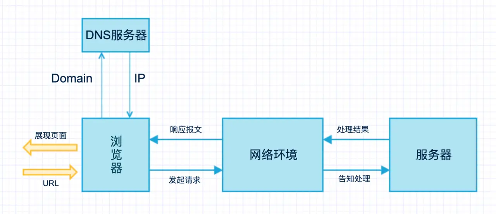

**从浏览器输入URL开始到渲染结束大致分为下面几个流程**

* DNS解析：把域名解析成IP地址
* TCP 建立连接：TCP三次握手
* 发送HTTP请求
* 服务器处理并响应报文
* 浏览器解析并渲染页面
* 断开连接：TCP 结束连接

### 一、什么是URL？
URL（Uniform Resource Locator），统一资源定位符，用于定位互联网上资源，俗称网址。
一般遵守下面的语法规则：
scheme://host.domain:port/path/filename
各部分解释如下：

* scheme - 定义因特网服务的类型。常见的协议有 http、https、ftp、file，其中最常见的类型是 http，而 https 则是进行加密的网络传输。
* host - 定义域主机（http 的默认主机是 www）
* domain - 定义因特网域名，比如 baodu.com
* port - 定义主机上的端口号（http 的默认端口号是 80）
* path - 定义服务器上的路径（如果省略，则文档必须位于网站的根目录中）
* filename - 定义文档/资源的名称

### 二、域名解析（DNS）
**为什么需要域名解析？**:浏览器并不能直接通过域名找到对应的服务器，而是要通过 IP 地址。当然也可以直接IP地址去访问，但是以人类的记忆习惯去记住各个网站的IP地址...那，我只能祝你幸福。

**先说下IP地址：** IP 地址是一个 32 位的二进制数，比如 127.0.0.1 为本机 IP。它的作用就是便于记忆和沟通的一组服务器的地址。域名就相当于 IP 地址的别名。。

**什么是域名解析:** DNS 协议提供通过域名查找 IP 地址，或逆向从 IP 地址反查域名的服务。DNS 是一个网络服务器，我们的域名解析简单来说就是在 DNS 上记录一条信息记录。

### 三、TCP 三次握手
在客户端发送数据之前会发起 TCP 三次握手用以同步客户端和服务端的序列号和确认号，并交换 TCP 窗口大小信息。
**TCP 三次握手的过程如下：**

* 客户端发送一个带 SYN=1，Seq=X 的数据包到服务器端口（第一次握手，由浏览器发起，告诉服务器我要发送请求了）
* 服务器发回一个带 SYN=1， ACK=X+1， Seq=Y 的响应包以示传达确认信息（第二次握手，由服务器发起，告诉浏览器我准备接受了，你赶紧发送吧）
* 客户端再回传一个带 ACK=Y+1， Seq=Z 的数据包，代表“握手结束”（第三次握手，由浏览器发送，告诉服务器，我马上就发了，准备接受吧）

- TCP(Transmission Control Protocol)传输控制协议
TCP是主机对主机层的传输控制协议，提供可靠的连接服务，采用三次握手确认建立一个连接：  
位码即tcp标志位，有6种标示：SYN(synchronous建立联机) ACK(acknowledgement 确认) PSH(push传送) FIN(finish结束) RST(reset重置) URG(urgent紧急)Sequence number(顺序号码) Acknowledge number(确认号码)

第一次握手：主机A发送位码为syn＝1，随机产生seq number=1234567的数据包到服务器，主机B由SYN=1知道，A要求建立联机；

第二次握手：主机B收到请求后要确认联机信息，向A发送ack number=(主机A的seq+1)，syn=1，ack=1，随机产生seq=7654321的包；

第三次握手：主机A收到后检查ack number是否正确，即第一次发送的seq number+1，以及位码ack是否为1，若正确，主机A会再发送ack number=(主机B的seq+1)，ack=1，主机B收到后确认seq值与ack=1则连接建立成功。

**为啥需要三次握手？**
谢希仁著《计算机网络》中讲“三次握手”的目的是**“为了防止已失效的连接请求报文段突然又传送到了服务端，因而产生错误”**。

### 四、向服务器发送HTTP请求
建立TCP连接后，开始向Web服务器发送HTTP请求报文。

请求方法包含 8 种：GET、POST、PUT、DELETE、PATCH、HEAD、OPTIONS、TRACE。
URL 即请求地址，由 <协议>：//<主机>：<端口>/<路径>?<参数> 组成
协议版本即 http 版本号
POST  /chapter17/user.html HTTP/1.1

// 以上代码中“POST”代表请求方法，“/chapter17/user.html”表示 URL，“HTTP/1.1”代表协议和协议的版本。现在比较流行的是 Http1.1 版本
复制代码一个典型的 http request header 一般需要包括请求的方法，例如 GET 或者 POST 等，不常用的还有 PUT 和 DELETE 、HEAD、OPTION以及 TRACE 方法，一般项目中，浏览器只会发起 GET 或者 POST 请求。
服务器处理请求并返回 HTTP 报文
此处注意：
这里可能会发生用户输入的为“baidu.com/”而非“https:/…参见文章。
服务器接受到请求后，对相应的请求作出相应的处理，处理完成后并作出相应的http 响应报文

**响应行包含：协议版本，状态码，状态码描述**
状态码规则如下：

* 1xx：指示信息--表示请求已接收，继续处理。
* 2xx：成功--表示请求已被成功接收、理解、接受。
* 3xx：重定向--要完成请求必须进行更进一步的操作。
* 4xx：客户端错误--请求有语法错误或请求无法实现。
* 5xx：服务器端错误--服务器未能实现合法的请求。

### 六、浏览器解析渲染页面
不做过多解释，搬我觉得网上比较简单易懂的
浏览器拿到响应文本 HTML 后，接下来介绍下浏览器渲染机制

浏览器解析渲染页面分为一下五个步骤：

1. 根据 HTML 解析出 DOM 树
2. 根据 CSS 解析生成 CSS 规则树
3. 结合 DOM 树和 CSS 规则树，生成渲染树
4. 根据渲染树计算每一个节点的信息
5. 根据计算好的信息绘制页面

1.根据 HTML 解析 DOM 树
* 根据 HTML 的内容，将标签按照结构解析成为 DOM 树，DOM 树解析的过程是一个深度优先遍历。即先构建当前节点的所有子节点，再构建下一个兄弟节点。
* 在读取 HTML 文档，构建 DOM 树的过程中，若遇到 script 标签，则 DOM 树的构建会暂停，直至脚本执行完毕。

2.根据 CSS 解析生成 CSS 规则树
* 解析 CSS 规则树时 js 执行将暂停，直至 CSS 规则树就绪。
* 浏览器在 CSS 规则树生成之前不会进行渲染。

3.结合 DOM 树和 CSS 规则树，生成渲染树
* DOM 树和 CSS 规则树全部准备好了以后，浏览器才会开始构建渲染树。
* 精简 CSS 并可以加快 CSS 规则树的构建，从而加快页面相应速度。

4.根据渲染树计算每一个节点的信息（布局）
* 布局：通过渲染树中渲染对象的信息，计算出每一个渲染对象的位置和尺寸
* 回流：在布局完成后，发现了某个部分发生了变化影响了布局，那就需要倒回去重新渲染。

5.根据计算好的信息绘制页面
* 绘制阶段，系统会遍历呈现树，并调用呈现器的“paint”方法，将呈现器的内容显示在屏幕上。
* 重绘：某个元素的背景颜色，文字颜色等，不影响元素周围或内部布局的属性，将只会引起浏览器的重绘。
* 回流：某个元素的尺寸发生了变化，则需重新计算渲染树，重新渲染。

### 七、断开连接
当数据传送完毕，需要断开 tcp 连接，此时发起 tcp 四次挥手。

- 发起方向被动方发送报文，Fin、Ack、Seq，表示已经没有数据传输了。并进入 FIN_WAIT_1 状态。(第一次挥手：由浏览器发起的，发送给服务器，我请求报文发送完了，你准备关闭吧)
- 被动方发送报文，Ack、Seq，表示同意关闭请求。此时主机发起方进入 FIN_WAIT_2 状态。(第二次挥手：由服务器发起的，告诉浏览器，我请求报文接受完了，我准备关闭了，你也准备吧)
- 被动方向发起方发送报文段，Fin、Ack、Seq，请求关闭连接。并进入 LAST_ACK 状态。(第三次挥手：由服务器发起，告诉浏览器，我响应报文发送完了，你准备关闭吧)
- 发起方向被动方发送报文段，Ack、Seq。然后进入等待 TIME_WAIT 状态。被动方收到发起方的报文段以后关闭连接。发起方等待一定时间未收到回复，则正常关闭。(第四次挥手：由浏览器发起，告诉服务器，我响应报文接受完了，我准备关闭了，你也准备吧)

### 八、浏览器发生异步请求
在web2.0时代，即使在页面渲染后客户端还是持续与服务器端通信，这个模式被称为AJAX

**JS的解析是由浏览器中的JS解析引擎完成的**。JS是单线程运行，也就是说，在同一个时间内只能做一件事，所有的任务都需要排队，前一个任务结束，后一个任务才能开始。但是又存在某些任务比较耗时，如IO读写等，所以需要一种机制可以先执行排在后面的任务，这就是：同步任务(synchronous)和异步任务(asynchronous)。JS的执行机制就可以看做是一个主线程加上一个任务队列(task queue)。同步任务就是放在主线程上执行的任务，异步任务是放在任务队列中的任务。所有的同步任务在主线程上执行，形成一个执行栈;异步任务有了运行结果就会在任务队列中放置一个事件；脚本运行时先依次运行执行栈，然后会从任务队列里提取事件，运行任务队列中的任务，这个过程是不断重复的，所以又叫做事件循环(Event loop)。

浏览器在解析过程中，如果遇到请求外部资源时，请求过程是异步的，并不会影响HTML文档进行加载，但是当文档加载过程中遇到JS文件，HTML文档会挂起渲染过程，不仅要等到文档中JS文件加载完毕还要等待解析执行完毕，才会继续HTML的渲染过程。原因是因为JS有可能修改DOM结构，这就意味着JS执行完成前，后续所有资源的下载是没有必要的，这就是JS阻塞后续资源下载的根本原因。CSS文件的加载不影响JS文件的加载，但是却影响JS文件的执行。JS代码执行前浏览器必须保证CSS文件已经下载并加载完毕。
